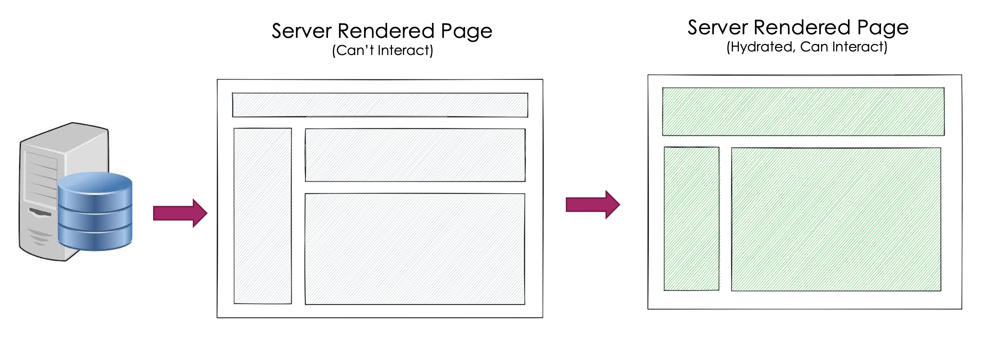
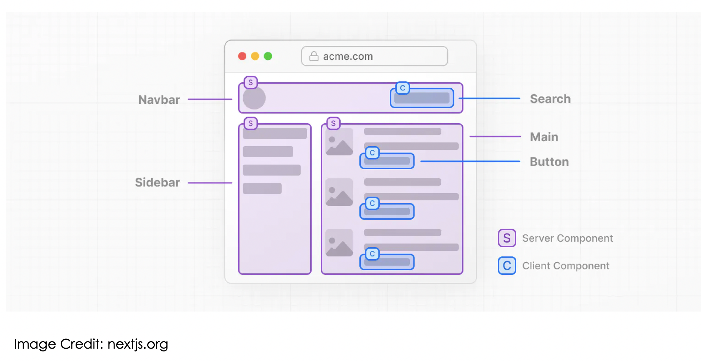
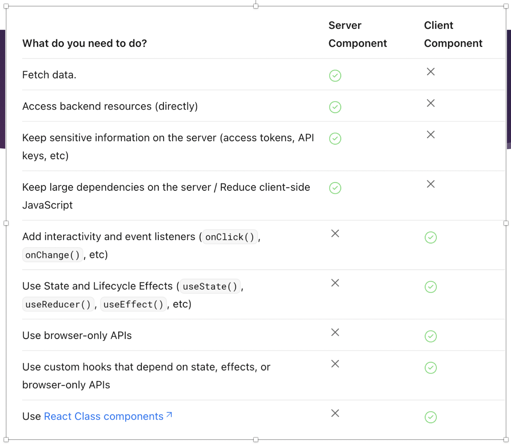

# React Server Components

Introduced in React 18 as experimental feature and stabilised in React 19. 

## Client Side Rendering Vs Server Side Rendering

## How SSR Works?

## What Are Server Components?

Server Components—that run ahead of time and are excluded from your JavaScript bundle. Server Components can run during the build, letting you read from the filesystem or fetch static content. They can also run on the server, letting you access your data layer without having to build an API. You can pass data by props from Server Components to the interactive Client Components in the browser.

## 🚀 Key Characteristics

- **Server-Side Rendering**: Components are rendered on the server, reducing the amount of JavaScript sent to the client
- **Zero-Bundle-Size**: Server Components are not included in the client-side JavaScript bundle, leading to smaller bundle sizes
- **Data Fetching**: They can fetch data directly from the server or filesystem without exposing APIs to the client
- **Interoperability**: Server Components can pass data and JSX to Client Components, enabling seamless integration
- **SEO-friendly** – Rendered HTML content is visible to search engines.

## Server vs Client Components

## SSR Setup

- **Without a Server**: Server Components can run at build time to fetch static content, eliminating the need for a web server.​
- **With a Server**: They can also run on a web server during a request, allowing access to dynamic data sources.

## Summary

- Server Components simplify data fetching and reduce client-side load.
- They allow secure, efficient rendering with zero runtime JS for non-interactive parts.
- Best used for read-only, performance-critical, or SEO-sensitive UI.
- Combine them with Client Components to balance performance and interactivity.

