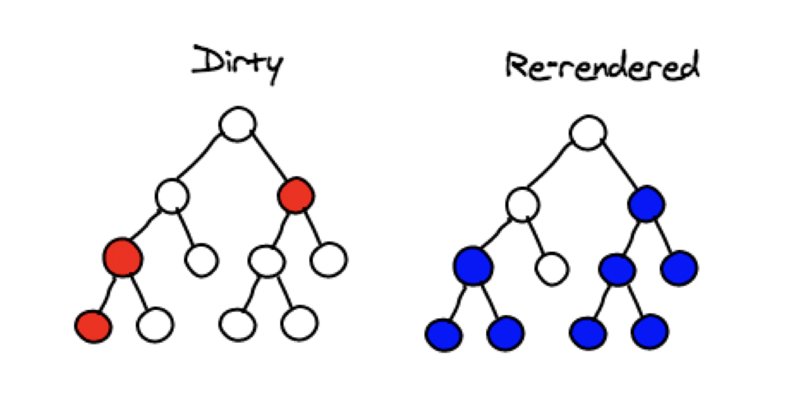

# useTransition (Async Transitions)

```useTransition``` is a React Hook that lets you render a part of the UI in the background. 

```useTransition``` was introduced in React 18 but async functions in transitions was not supported at that time. 

async functions in transitions is supported as part of React 19. 

## Why do we need Transitions?

Scenario: User input is lagging when the search results (long list) is being rendered.


### How React (re)rendring works?



## 🚀 Key Points

- Async functions are also called ```Actions```
- Used to provide non blocking updates to the UI
- while a Transition is in progress, your UI stays responsive.


## ✅ Usage Example (Promise)

```tsx
function UpdateName({}) {
  const [name, setName] = useState("");
  const [error, setError] = useState(null);
  const [isPending, startTransition] = useTransition();

  const handleSubmit = () => {
    startTransition(async () => {
      const error = await updateName(name);
      if (error) {
        setError(error);
        return;
      } 
      redirect("/path");
    })
  };

  return (
    <div>
      <input value={name} onChange={(event) => setName(event.target.value)} />
      <button onClick={handleSubmit} disabled={isPending}>
        Update
      </button>
      {error && <p>{error}</p>}
    </div>
  );
}
```


